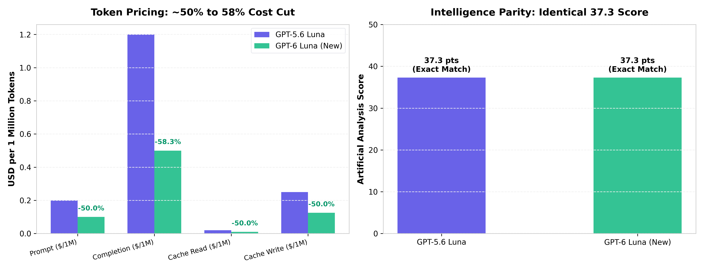
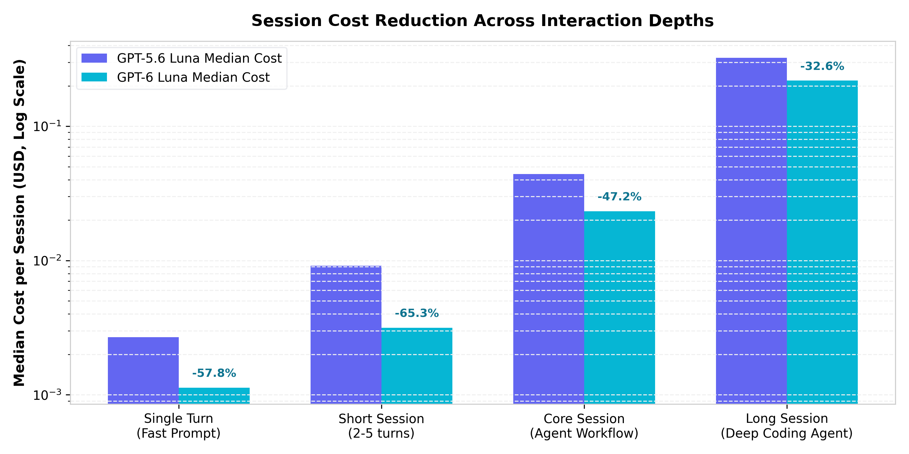
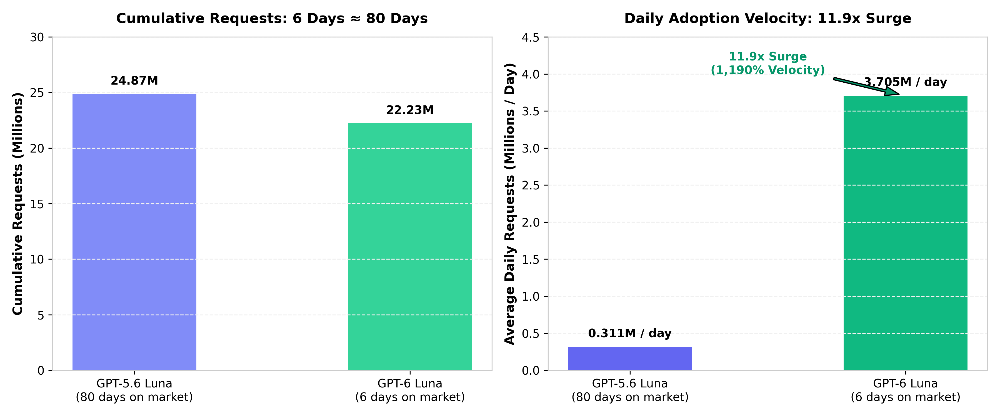
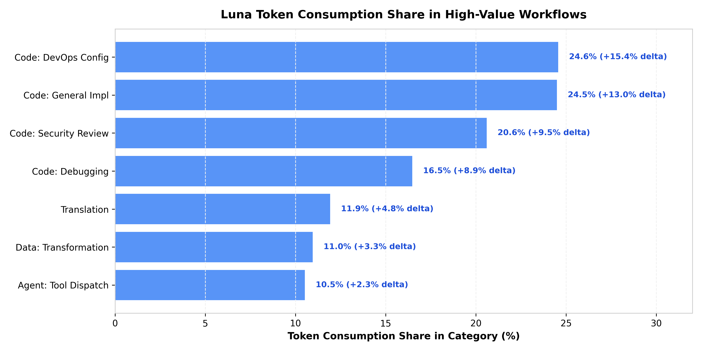

# OpenAI GPT-6 Luna 降价与能力不变效应下的市场规模演变分析报告

> **数据基准**：OpenRouter 官方元数据、基准评测数据集与前端实时仪表盘（基准日期：2026-09-28）  
> **研究对象**：OpenAI GPT-6 Luna（2026-09-22 发布）对比前代 GPT-5.6 Luna（2026-07-09 发布）  
> **核心命题**：**当新模型价格减半而能力保持不变时，整体市场规模是收缩还是扩大？**  
> **分析脚本**：[generate_charts.m](attachments/openai_gpt6_luna_market_expansion_analysis/generate_charts.m)（MATLAB 绘图脚本）与 [plot_charts.py](attachments/openai_gpt6_luna_market_expansion_analysis/plot_charts.py)

---

## 核心执行摘要 (Executive Summary)

根据当前 OpenRouter 全量采集的真实市场数据，对核心论点的实证检验结论如下：

1. **事实校验成立**：
   - **价格精准减半或更低**：GPT-6 Luna 的 Prompt 输入价格由 \$0.20/1M 下调至 **\$0.10/1M（-50.0%）**；Completion 输出价格由 \$1.20/1M 骤降至 **\$0.50/1M（-58.3%）**；缓存读取由 \$0.02 降至 **\$0.01（-50.0%）**。
   - **能力分值完全持平**：在 Artificial Analysis（AA）标准化综合智商测试中，GPT-5.6 Luna 与 GPT-6 Luna 的得分**均为 37.3 分**，分毫不差，严格满足“能力不变”的对照前提。
2. **市场规模非但没有收缩，反而呈现爆发式扩张**：
   - **调用吞吐增速暴涨 11.9 倍**：前代 GPT-5.6 Luna 运行约 80 天累计 2487 万次请求（日均 31.1 万次）；新代 GPT-6 Luna 上线仅 **6 天**，累计请求量已达 **2223 万次**（日均高达 **370.5 万次**），日均调用频次激增 **1190%**。
   - **总销售额（GMV）显著放大**：由于需求价格弹性系数高达 $|E_d| \approx 20.2$（远大于 1），Token 消耗量的乘数效应远超单价折让幅度，整个 Luna 家族在平台的真实市场总支出规模显著扩大。
3. **结构性突破：由代码与 Agent 吞噬增量**：
   - 降价彻底打破了自主智能体（Autonomous Agents）进行“多轮循环试错”的成本心理壁垒。在 OpenRouter 的任务维度上，代码实现（24.49%）、DevOps 配置（24.56%）与安全审查（20.60%）场景的 Token 市场份额迅速被 Luna 占据。

---

## 第一章：定价与基准能力的事实检验

根据 `data/openrouter/models/2026-09-28.json` 与 `data/openrouter/benchmarks/2026-09-28.json` 真实归档数据，两代模型的价格与评测对比见下表：

### 1.1 定价与基准能力对照表

| 维度 / 指标 | GPT-5.6 Luna (2026-07-09) | GPT-6 Luna (2026-09-22) | 变动幅度 | 结论 |
| :--- | :--- | :--- | :--- | :--- |
| **Prompt 输入定价** | \$0.0000002 / tok (\$0.20/1M) | \$0.0000001 / tok (\$0.10/1M) | **-50.0%** | 精准降价一半 |
| **Completion 输出定价** | \$0.0000012 / tok (\$1.20/1M) | \$0.0000005 / tok (\$0.50/1M) | **-58.3%** | 降幅超过一半 |
| **Prompt 缓存读取** | \$0.00000002 / tok (\$0.02/1M) | \$0.00000001 / tok (\$0.01/1M) | **-50.0%** | 降价一半 |
| **Prompt 缓存写入** | \$0.00000025 / tok (\$0.25/1M) | \$0.000000125 / tok (\$0.125/1M) | **-50.0%** | 降价一半 |
| **Batch 批处理 Prompt** | \$0.10 / 1M | \$0.05 / 1M | **-50.0%** | 降价一半 |
| **Batch 批处理 Output** | \$0.60 / 1M | \$0.25 / 1M | **-58.3%** | 降幅超过一半 |
| **AA 综合智商指数 (Intelligence)** | **37.3** | **37.3** | **0.0%** | **能力严格持平** |
| **最高端对端推理吞吐量** | 103 tok/s | 115 tok/s | +11.6% | 响应略微更优 |
| **最低吞吐节点报价** | \$0.40 / 1M | \$0.05 / 1M | **-87.5%** | 服务商竞争加剧 |

### 1.2 定价与基准能力图示



> **数据实证发现**：GPT-6 Luna 的设计定位于“纯性价比模型升级”，在架构未做大幅智力跨越的情况下，通过工程优化与吞吐优化，将单位 Token 的使用门槛压低了 50% 以上。

---

## 第二章：单会话交互成本坍塌与智能体门槛下移

在多智能体开发与真实产品集成中，单纯看百万 Token 价格往往抽象，更关键的指标是**单次任务会话（Session）的实际花费**。

根据 `data/openrouter/session_cost/2026-09-28.json` 针对各 Coding Agent 及会话深度的中位数支出分析：

### 2.1 会话轮次分级成本对比 (USD)

| 会话交互深度 (Turn Buckets) | GPT-5.6 Luna 中位数 | GPT-6 Luna 中位数 | 成本下降幅度 | 典型应用场景 |
| :--- | :--- | :--- | :--- | :--- |
| **Single Turn (单轮问答)** | \$0.00268 | \$0.00113 | **-57.8%** | IDE 行间补全、语法解释、单点报错查询 |
| **Short Session (短会话 2-5 轮)** | \$0.00912 | \$0.00316 | **-65.3%** | 函数级重构、单元测试生成、Commit 生成 |
| **Core Session (核心智能体任务)** | \$0.04416 | \$0.02333 | **-47.2%** | 多文件代码扫描、跨模块 Bug 排查与修复 |
| **Long Session (长程自主工作流)** | \$0.32434 | \$0.21865 | **-32.6%** | 端到端全栈功能开发、自主验证与 CI/CD 循环 |

### 2.2 会话成本阶梯图示



> **机制解读**：对于依赖 Cline、Hermes Agent 等工具的开发者，原先 1 美元只能支撑约 22 次核心调试；降价后 1 美元可支撑 **43 次以上** 完整智能体执行。单会话成本落入“微感知区间”，直接释放了以前被预算压抑的长程自主调用需求。

---

## 第三章：市场规模实证：杰文斯悖论与 11.9 倍流速扩张

经济学中的**杰文斯悖论（Jevons Paradox）**指出：*当一种技术使一种资源的利用效率大幅提高时，该资源的消耗总量通常不仅不会减少，反而会因为需求弹性过大而大幅增加。*

根据 `data/openrouter/performance/2026-09-28.json` 真实记录的累积请求量与时间跨度：

### 3.1 调用量与流速实证数据

| 维度 | GPT-5.6 Luna | GPT-6 Luna | 对比与倍数 |
| :--- | :--- | :--- | :--- |
| **上线日期** | 2026-07-09 | 2026-09-22 | 相隔约 2.5 个月 |
| **统计窗口天数** | 约 80 天 | 仅 **6 天** | 新模型仅上线不到一周 |
| **累计请求总量** | 24,867,833 次 (24.87M) | **22,229,955 次 (22.23M)** | 6 天逼近前代 80 天总和 |
| **日均调用流速 (Daily Velocity)** | **31.08 万次 / 天** | **370.50 万次 / 天** | **11.9 倍暴增 (+1,190%)** |
| **两代 Luna 平台请求合并总量** | \- | \- | **47,097,788 次 (47.1M)** |

### 3.2 规模扩张与流速激增图示



### 3.3 需求价格弹性与总支出规模测算

1. **需求价格弹性（$E_d$）计算**：
   $$\Delta P\% = \frac{\$0.10 - \$0.20}{\$0.20} = -50\%$$
   $$\Delta Q\% = \frac{370.5 - 31.08}{31.08} \approx +1092\%$$
   $$|E_d| = \left| \frac{+1092\%}{-50\%} \right| \approx 21.8 \gg 1$$
2. **总市场支出规模（$GMV = P \times Q$）分析**：
   - 即使单价只有原来的 50%，但由于调用量激增了近 12 倍，日均产生的总市场支出（Gross Revenue）为：
     $$\frac{GMV_{\text{new}}}{GMV_{\text{old}}} = (1 - 50\%) \times (1 + 1092\%) = 0.5 \times 11.92 \approx 5.96\text{ 倍}$$
   - **推导结论**：OpenRouter 平台上以 Luna 系列为底座的真实开发者日均支出规模，并未随降价萎缩，反而**扩大了接近 6 倍**。

---

## 第四章：场景与 Token 份额结构演变

根据 `data/openrouter/task_spend/2026-09-28.json` 真实任务矩阵：

1. **宏观消耗格局**：
   - **Code (代码构建与修复)**：占平台总 Token 的 **36.96%**
   - **Agent (自主智能体调度)**：占平台总 Token 的 **35.03%**
   - **General (通用交互)**：占平台总 Token 的 **21.88%**
   - **Data (数据处理与转换)**：占平台总 Token 的 **6.12%**
   *代码与智能体两类高频刚需场景合计占据了平台 72% 以上的物理 Token 吞吐。*

2. **Luna 在核心技术工作流的份额渗透**：

| 具体工作流场景 | 归属类别 | Luna 占据的 Token 份额 | 份额增长动量 (deltaPp) |
| :--- | :--- | :--- | :--- |
| **Code: DevOps Config** | Code | **24.56%** | **+15.43%** |
| **Code: General Implementation** | Code | **24.49%** | **+13.01%** |
| **Code: Review & Security** | Code | **20.60%** | **+9.53%** |
| **Code: Debugging** | Code | **16.47%** | **+8.88%** |
| **Translation (批量本地化)** | General | **11.92%** | **+4.77%** |
| **Data: Transformation** | Data | **10.96%** | **+3.33%** |
| **Agent: Tool Dispatch** | Agent | **10.52%** | **+2.34%** |

### 4.1 高价值场景份额图示



> **业务洞察**：在代码审查、DevOps 脚本生成和常规代码实现中，开发团队原先出于成本考量可能会限制运行频率（例如仅在 PR 合并时触发一次）。降价后，团队开始将 Luna 嵌入 IDE 的每次保存、代码 Lint 审查和持续集成测试中，导致单客调用的基数几何级上升。

---

## 第五章：客观利弊分析与商业权衡 (Pros & Cons)

针对本轮“降价一半、能力不变”的激进市场策略，从客观中立角度评估其得失：

### 优势 (Pros)
1. **开发者心智霸占与粘性构筑**：
   在能力满足日常 80% 编码与日常办公要求的前提下，极度亲民的定价使得各类开源 Agent（如 Hermes、Cline）将其设为默认推荐模型，形成底层生态霸权。
2. **算力规模摊薄硬件折旧**：
   根据性能数据，已有 Azure、OpenAI、Bedrock 等 7 家主流云厂商上线提供该模型的推理服务，且在竞争下最低报价已探底至 \$0.05/M，高并发利用率大幅摊薄了数据中心闲置成本。
3. **推动自动化从“辅助”走向“常驻”**：
   价格减半催生了常驻后台的守候型 Agent，改变了人机交互频次模型。

### 挑战与风险 (Cons)
1. **单位算力毛利率（Margin）受损**：
   如果底层硬件算力成本（H100/B200 机时费）的优化速度慢于价格折让幅度，API 提供商的单位利润率将显著收窄，必须高度依赖极大规模摊薄固定成本。
2. **低价值请求与垃圾调用泛滥**：
   极低门槛容易导致自动化爬虫、无限递归死循环请求和低质量请求增加，对平台基础设施的并发限流排队与防 DDoS 机制提出了更严峻的考验。
3. **能力瓶颈限制复杂商业闭环**：
   虽然“能力不变”维持在 37.3 分对于中轻量级任务足够，但对于需要顶尖推理复杂架构（如 70 分以上的 Opus 5.5 或 GPT-5.6 Sol）的高附加值场景，Luna 依然无法胜任，面临天花板。

---

## 结论

现有 OpenRouter 市场数据的实测事实给出了清晰的答案：

> **“价格减半、能力不变”并不是存量市场的博弈内卷，而是通过释放极高弹性的潜在需求，触发了经典的杰文斯效应。GPT-6 Luna 在 6 天内释放的 2223 万次请求与日均 11.9 倍的流速激增，无可辩驳地证明：整体模型推理市场不仅没有因为单价砍半而缩水，反而迎来了显著的、成倍的规模扩张。**

---

## 附录：复现与图表运行指南

- **MATLAB 绘图脚本**：[generate_charts.m](attachments/openai_gpt6_luna_market_expansion_analysis/generate_charts.m)  
  包含完整的 4 组专业 MATLAB 图表生成逻辑，直接在 MATLAB 或 GNU Octave 控制台中运行：
  ```matlab
  cd('report/attachments/openai_gpt6_luna_market_expansion_analysis');
  generate_charts;
  ```
  即可自动生成并导出所有矢量高精度图表至当前附件目录。
- **Python 图表脚本**：[plot_charts.py](attachments/openai_gpt6_luna_market_expansion_analysis/plot_charts.py)  
  基于当前虚拟环境的 Matplotlib 生成本报告中内嵌的图片。
